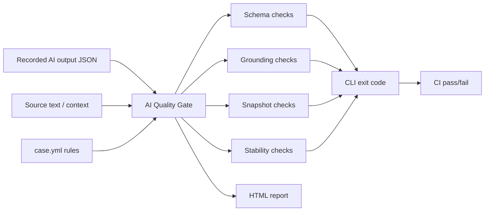

# AI Quality Gate

[](https://github.com/kartsan03/ai-quality-gate/actions/workflows/ci.yml)
[](https://pypi.org/project/aiqg/)
[](pyproject.toml)
[](LICENSE)

A small, local CI gate for AI feature outputs. You record what your LLM
pipeline produced, describe what "acceptable" means in a YAML case file, and
`aiqg` tells you (and your CI) whether the outputs hold up.

**No API key required.** Everything runs offline against recorded JSON
outputs. There is no model call anywhere in this tool.

## Why it exists

Teams ship extraction, RAG, classification and summarization features on top
of models that are nondeterministic by design. Most output regressions are
not subtle semantic drift; they are broken JSON, a missing field, an invented
invoice total, an answer with no citation, or the model falling back to
"as an AI language model". Those failures are cheap to catch with
deterministic checks, and catching them in CI is much cheaper than catching
them in production. This tool is that deterministic layer: boring checks,
run on every change, exit code 0 or 1.

It is deliberately not an eval platform. No dashboards, no scores from a
judge model, no embeddings. If a check here fails, a human can read the
failure message and know exactly why.

## How this compares

promptfoo and DeepEval are eval runners: they call model providers to produce
fresh outputs and score them. aiqg is the deterministic layer that gates the
outputs you already have. They are complementary, not competing — many teams
run both.

| | aiqg | promptfoo | DeepEval |
|---|---|---|---|
| Calls models / needs API keys | never | yes, to generate outputs | yes, most metrics are LLM-judged |
| Runs fully offline | yes | no | no |
| Verdict | deterministic: same inputs, same exit code | deterministic for exact/regex assertions | model-scored, scores can vary |
| Usage model | point it at recorded output files | define prompts + providers in YAML | write pytest test cases |
| Role | regression gate on recorded outputs | prompt runner, red-teaming, model selection | semantic metrics: faithfulness, relevance |

## How it works



No model calls anywhere in this flow. The gate reads files you already have
and returns an exit code your CI already understands.

## What it checks

| Check | What it catches |
|---|---|
| `json_schema` | Output does not match a JSON Schema (types, enums, required keys) |
| `required_fields` | A field is missing, empty, or an empty list |
| `regex` | A field does not match its expected pattern (IDs, dates, codes) |
| `grounding` | An output value or number does not appear in the source text; missing citations |
| `forbidden_phrases` | Model fallback boilerplate ("as an AI language model", ...) |
| `snapshot` | Output drifted from an approved snapshot, ignoring volatile fields |
| `stability` | Critical fields differ across multiple recorded runs of the same input |

Malformed JSON in an output file is reported as a failure of that file, not
a crash of the run.

## Quick start

```
pip install aiqg
aiqg init my_feature
aiqg run my_feature
```

`init` scaffolds a case that runs green out of the box; replace `source.txt`
and `outputs/` with your recorded data and edit the checks. From a source
checkout:

```
pip install -e .[dev]
pytest
python -m aiqg run examples/passing/
```

The last command exits 0: four cases, all checks green.

To see the gate actually catch things, run the regression set. It contains
deliberately bad outputs (a hallucinated invoice total, an uncited RAG answer
with invented numbers, a classification that flips between runs, a summary
that collapsed into "as an AI language model") and exits 1 on purpose:

```
python -m aiqg run examples/regressions/
```

## Example commands

```
# the passing set, exits 0
python -m aiqg run examples/passing/

# the failure demo, exits 1 by design
python -m aiqg run examples/regressions/

# one case
python -m aiqg run examples/passing/invoice_extraction/case.yml

# with a static HTML report
python -m aiqg run examples/regressions/ --html reports/sample_report.html

# with a JUnit XML report for CI test annotations
python -m aiqg run examples/regressions/ --junit junit.xml
```

The package also installs an `aiqg` console script, so `aiqg run ...` works
everywhere the module form does.

## Exit codes

| Code | Meaning |
|---|---|
| `0` | All checks passed |
| `1` | At least one check failed (the gate caught something) |
| `2` | Setup error: bad path, no cases found, unknown check name |

`1` is reserved for gate failures only, so a CI pipeline can treat it as
"the recorded outputs regressed" without mistaking a typo in a path for a
real regression.

## Example output

From the regression set:

```
FAIL  invoice_extraction_regression  grounding  examples/regressions/invoice_extraction/outputs/bad.json
      - grounding: invoice_number='INV-2024-187' not found in source
      - grounding: total='6,868.50' not found in source
FAIL  support_ticket_classification_regression  stability  (all outputs)
      - stability: category differs across outputs: run_1.json='account_access', run_2.json='account_access', run_3.json='billing'

4 cases, 6 outputs, 8 checks passed, 11 failed
failures by check: grounding=3, required_fields=2, forbidden_phrases=2, snapshot=2, regex=1, stability=1
```

A sample report generated from the regression set is committed at
[reports/sample_report.html](reports/sample_report.html).

## Included example results

Actual numbers from running the committed examples:

| Example set | Cases | Outputs | Passed checks | Failed checks | Exit code |
|---|---:|---:|---:|---:|---:|
| `examples/passing/` | 4 | 5 | 17 | 0 | 0 |
| `examples/regressions/` | 4 | 6 | 8 | 11 | 1 |

Every failure in the regression set is a specific, deliberate defect: a
hallucinated total, an uncited answer, a flipped classification, a fallback
phrase. CI re-runs both sets on every push and asserts the exit codes, so
the pass/fail behavior in this table is enforced, not just documented.

## Project structure

```
aiqg/
  checks.py     the seven validators, plain functions
  runner.py     case loading, output discovery, check dispatch
  cli.py        argparse CLI, terminal summary, exit code
  report.py     static HTML report (no JS)
examples/
  passing/      four cases with good recorded outputs, exits 0
    invoice_extraction/           source + schema + snapshot
    rag_answer/                   context + cited answer
    support_ticket_classification/  ticket + two consistent runs
    crm_summary/                  call notes + faithful summary
  regressions/  same cases with bad outputs, exits 1 by design
tests/          pytest suite for the validators and the runner
docs/           checks reference, recording-outputs, promptfoo/DeepEval guide
.github/actions/aiqg-run/   composite Action (pinned aiqg==0.3.1)
```

## How to add a case

1. Make a directory with the source text and an `outputs/` folder of recorded
   JSON outputs (from your logs, a replay script, wherever).
2. Write `case.yml`:

```yaml
name: my_feature
task_type: extraction
source_file: source.txt
outputs_glob: outputs/*.json
checks:
  required_fields:
    fields: [customer, total]
  grounding:
    fields: [total]          # value must appear in source_file
  forbidden_phrases: {}       # {} uses the built-in phrase list
  snapshot:
    file: expected.json
    ignore: [confidence, generated_at]
```

3. Run `python -m aiqg run path/to/my_feature/case.yml`.

Grounding also supports `numbers_in: [answer]` (every number in the field
must appear in the source) and `require_citations: citations` (the field must
be a non-empty list). Field names take dotted paths like `customer.name`.

Every check and every `case.yml` key is documented in
[docs/checks.md](docs/checks.md); [docs/recording-outputs.md](docs/recording-outputs.md)
shows how to produce the recorded outputs (`aiqg ingest`, snapshots);
[docs/with-promptfoo-deepeval.md](docs/with-promptfoo-deepeval.md) covers
recording from those tools into fixtures for `aiqg run`.

## Using it in your own CI

### Composite Action (recommended)

Copy-paste workflow using the pinned composite action shipped in this repo
(`.github/actions/aiqg-run/`, installs `aiqg==0.3.1`):

```yaml
name: aiqg
on: [push, pull_request]
jobs:
  gate:
    runs-on: ubuntu-latest
    steps:
      - uses: actions/checkout@v4
      - uses: kartsan03/ai-quality-gate/.github/actions/aiqg-run@v0.3.1
        with:
          path: path/to/your/cases
          junit: junit.xml
      - uses: mikepenz/action-junit-report@v4
        if: always()
        with:
          report_paths: junit.xml
```

If you vendor the action from a checkout of this repository (or a submodule),
use a relative path instead:

```yaml
- uses: actions/checkout@v4
- uses: ./.github/actions/aiqg-run
  with:
    path: path/to/your/cases
    version: "0.3.1"
```

Inputs: `path` (required), `version` (default `0.3.1`), `junit`, `html`,
`python-version` (default `3.12`).

### Manual install

Install the package, point it at your cases, and let a non-zero exit fail the
pipeline. `--junit` makes GitHub Actions render each failure as an annotation
on the commit:

```yaml
- uses: actions/checkout@v4
- uses: actions/setup-python@v5
  with:
    python-version: "3.12"
- run: pip install "aiqg==0.3.1"
- run: aiqg run path/to/your/cases --junit junit.xml
- uses: mikepenz/action-junit-report@v4
  if: always()
  with:
    report_paths: junit.xml
```

Exit `1` means the recorded outputs regressed and fails the job; exit `2`
means a setup error (bad path, malformed case file) — the same distinction the
gate uses itself. No secrets are involved: the gate never calls a model.

## How CI works

`.github/workflows/ci.yml` installs the package and runs three gates:

1. `pytest` must pass.
2. `python -m aiqg run examples/passing/` must exit 0.
3. `python -m aiqg run examples/regressions/` must exit 1. A gate that lets
   the bad outputs through is itself a broken build.

## Limitations

- Grounding is substring matching after light normalization (case,
  whitespace, thousand separators). It catches invented values and numbers,
  not paraphrased or subtly wrong claims. A correct value quoted from the
  wrong context still passes.
- Stability compares recorded runs you provide; it cannot generate runs.
- Snapshot comparison is structural equality after dropping ignored keys;
  there is no fuzzy matching.
- Checks assume JSON outputs. Free-text outputs need to be wrapped in JSON
  first (a `{"answer": ...}` envelope is enough).

## What this does not do

It does not call models, score answers with an LLM judge, compute embedding
similarity, or measure "semantic correctness". Those layers are useful, but
they belong on top of a deterministic gate, not instead of one. This tool
only answers the cheap question reliably: did the output break any rule we
can state precisely?

## Who this is for

- AI QA / AQA engineers who need regression tests around model outputs that
  behave like normal CI tests.
- Data engineers validating LLM-produced records before they enter a
  warehouse or downstream pipeline.
- Backend teams shipping LLM-powered internal tools who want a merge-blocking
  check when a prompt or model change silently degrades outputs.

The pattern generalizes: record outputs, state the rules, gate the build.

## License

MIT, see [LICENSE](LICENSE).
